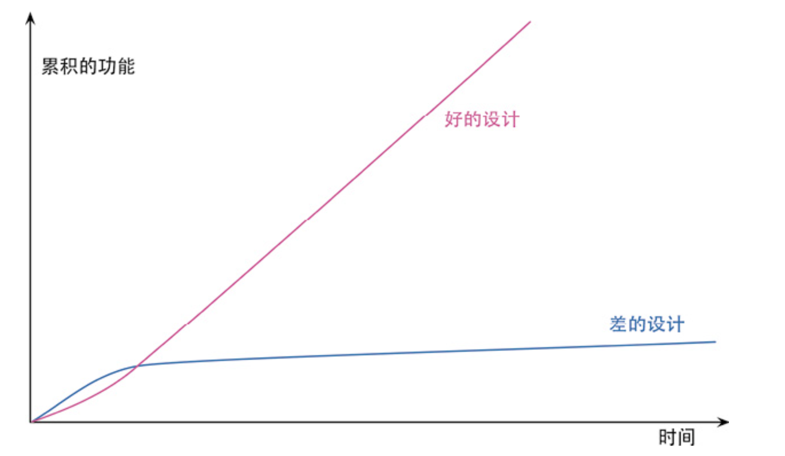

## 重构的原则

### 2.1 何谓重构

+ 重构的关键在于运用大量微小且保持软件行为的步骤，一步步达成大规模的修改
+ 每个单独的重构要么很小，要么由若干小步骤组合而成
+ 重构是为了让代码“更容易理解，更易于修改”

### 2.2 两顶帽子

- 两顶帽子
  1. 添加新功能
  2. 重构

+ 添加新功能时，我不应该修改既有代码，只管添加新功能
+ 重构时，我就不能再添加功能，只管调整代码的结构

###  2.3 为何重构

+ 重构改进软件的设计**(改善设计)**

  - 当人们只为短期目的而修改代码时，于是代码逐渐失去了自己的结构
  - 完成同样一件事，设计欠佳的程序往往需要更多代码, 这常常是因为代码在不同的地方使用完全相同的语句做同样的事
  - 因此改进设计的一个重要方向就是消除重复代码，使事物和行为在代码中只表述一次，这正是优秀设计的根本

+ 重构使软件更容易理解 **(提高可读性)**

  - 源码还有其他读者：几个月之后可能会有另一位程序员尝试读懂我的代码并对其做一些修改
  - 关键在于很多时候那个未来的开发者就是我自己

+ 重构帮助找到bug **(减少bug)**

  - 清晰的代码结构，更加利于我们理解代码，更快的帮我找到 bug

+ 重构提高编程速度

  - 如果代码结构没有一个良好的设计，那么添加功能会越来越困难

    

### 2.4 何时重构

+ 当类似的事情做三次时，就应该重构

  1. 第一次做某件事时只管去做
  2. 第二次做类似的事会产生反感, 但还可以去做
  3. 第三次再做类似的事，你就应该重构

+ 预备性重构: 让添加新功能更容易

  + 重构的最佳时机就在添加新功能之前

  + 动手前，经常发现如果对代码结构做一点微调，我的工作会容易得多

+ 帮助理解的重构: 使代码更易懂

  - 我需要先理解代码在做什么，然后才能着手修改
  - 能不能重构这段代码，令其一目了然？
    1. 我可能看见了一段结构糟糕的条件逻辑
    2. 也可能希望复用一个函数，但花费了几分钟才弄懂它到底在做什么，因为它的函数命名实在是太糟糕了
    3. 通过重构，我就把脑子里的理解转移到了代码本身，让代码具有更强的自解释性
    4. 给一两个变量改名，让它们更清楚地表达意图，以方便理解
    5. 将一个长函数拆成几个小函数
    6. 当代码变得更清晰一些时，我就会看见之前看不见的设计问题
    7. 在研读代码时，重构会引领我获得更高层面的理解

+ 捡垃圾式重构

  - 我已经理解代码在做什么，但发现它做得不好
    1. 例如逻辑不必要地迂回复杂
    2. 或者两个函数几乎完全相同，可以用一个参数化的函数取而代之
  - 如果我发现的垃圾很容易重构，我会马上重构它
  - 如果重构需要花一些精力，先将它记下来，完成当下的任务再回来重构它。
  - 重构的妙处就在于，每个小步骤都不会破坏代码——所以，有时一块垃圾在好几个月之后才终于清理干净，但即便每次清理并不完整，代码也不会被破坏。

+ 有计划的重构和见机行事的重构

  - 见机行事的重构: 并不专门安排一段时间来重构，而是在添加功能或修复 bug 的同时顺便重构
    1. 预备性重构
    2. 帮助理解的重构
    3. 捡垃圾式重构
  - 肮脏的代码必须重构，但漂亮的代码也需要很多重构。
  - 每次要修改时，首先令修改很容易（警告：这件事有时会很难），然后再进行这次容易的修改。
  - 有计划的重构: 如果团队过去忽视了重构，那么常常会需要专门花一些时间来优化代码库，以便更容易添加新功能

+ 长期重构
  + 如果想替换掉一个正在使用的库，可以先引入一层新的抽象，使其兼容新旧两个库的接口。一旦调用方已经完全改为使用这层抽象，替换下面的库就会容易得多

+ Code reivew时重构
  - 和代码提交者，一起交流重构
+ 怎么对经理说?
  - 不用告诉经理重构这件事，因此我们必须在工作中不断地重构， 而不是专门拿出一段时间来进行重构
+ 何时不应该重构
  - 如果丑陋的代码能被隐藏在一个 API 之下，我就可以容忍它继续保持丑陋。只有当我需要理解其工作原理时，对其进行重构才有价值
  - 如果重写比重构还容易，就别重构了

### 2.5 重构的挑战

> 重构的唯一目的就是让我们开发更快，用更少的工作量创造更大的价值。

+ 延缓新功能开发
  - “重构会拖慢进度”这种看法仍然很普遍，这可能是导致人们没有充分重构的最大阻力所在。
  - 之所以重构，因为它能让我们更快——添加功能更快，修复 bug 更快

+ 代码所有权

  - 调用该接口的库，没有权限修改。为了不影响其他调用者，不能直接给接口改名，可以通过新增接口

  - 旧的接口标记为“不推荐使用”（deprecated），等一段时间之后最终让其退休；但有些时候，旧的接口必须一直保留下去
  - 程序员可能各自分工负责系统的不同区域，但这种责任应该体现为监控自己责任区内发生的修改，而不是简单粗暴地禁止别人修改

+ 分支
  - 还有一些人（比如我本人）认为特性分支的生命还应该更短，我们采用的方法叫作持续集成（Continuous Integration，CI），也叫“基于主干开发”（Trunk-Based Development）。在使用 CI 时，每个团队成员每天至少向主线集成一次
  - 不过 CI 也有其代价：你必须使用相关的实践以确保主线随时处于健康状态，必须学会将大功能拆分成小块，还必须使用特性开关（feature toggle，也叫特性旗标，feature flag）将尚未完成又无法拆小的功能隐藏掉。
  - CI 的粉丝之所以喜欢这种工作方式，部分原因是它降低了分支合并的难度，不过最重要的原因还是 CI 与重构能良好配合

+ 测试
  - 代码应该有一套完备的测试套件
+ 遗留代码
  - 重构可以很好地帮助我们理解遗留系统
  - 引人误解的函数名可以改名，使其更好地反映代码用途
  - 添加测试

### 2.6 重构、架构和YAGNI

+ 重构对架构最大的影响在于，通过重构，我们能得到一个设计良好的代码库，使其能够优雅地应对不断变化的需求

### 2.7 重构与软件开发过程

+ 重构的第一块基石是自测试代码

