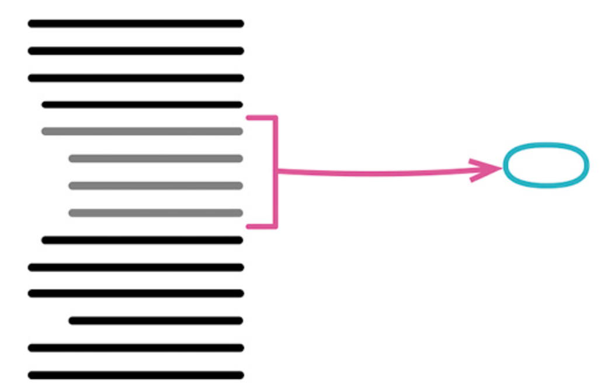
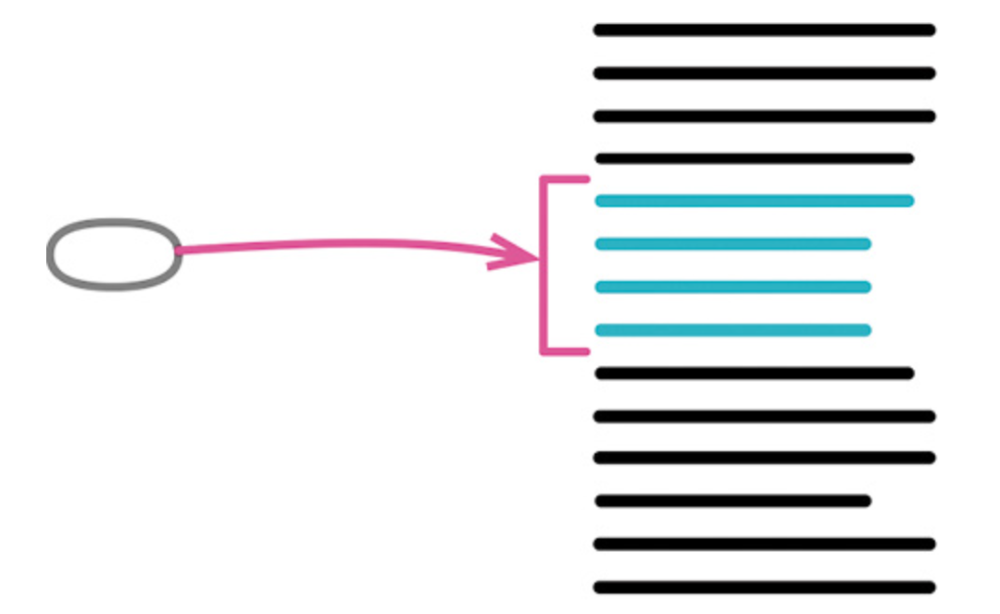
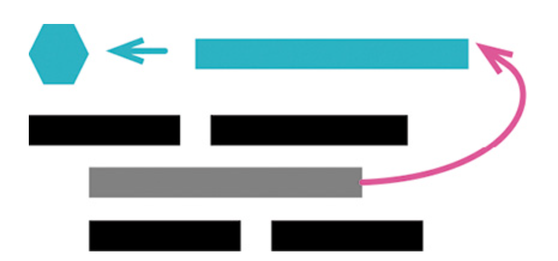
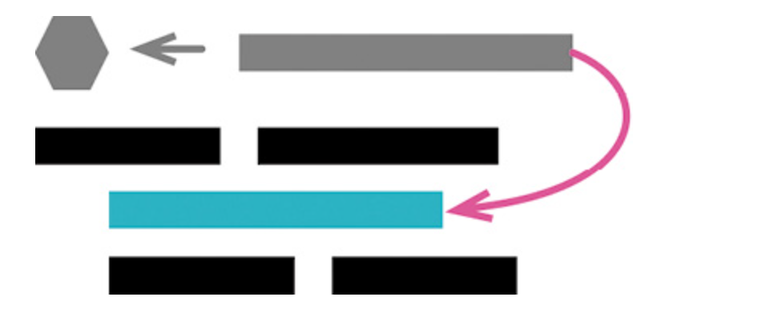

## 第一组重构

###  6.1 提炼函数（Extract Function）

#### 名字

+ 提炼函数（Extract Method）
  - 其反向重构：内联函数（115）



````js
function printOwing(invoice) {
  printBanner();
  let outstanding = calculateOutstanding();

  //print details
  console.log(`name: ${invoice.customer}`);
  console.log(`amount: ${outstanding}`);
}

function printOwing(invoice) {
  printBanner();
  let outstanding = calculateOutstanding();
  printDetails(outstanding);

  function printDetails(outstanding) {
    console.log(`name: ${invoice.customer}`);
    console.log(`amount: ${outstanding}`);
  }
}
````

#### 动机

- 何时应该把代码放进独立的函数？
  1. 有的观点从代码的长度考虑，认为一个函数应该能在一屏中显示
  2. 有的观点从复用的角度考虑，认为只要被用过不止一次的代码，就应该单独放进一个函数；只用过一次的代码则保持内联（inline）的状态
  3. 最合理的观点是""将意图与实现分开"
     - 如果你需要花时间浏览一段代码才能弄清它到底在干什么，那么就应该将其提炼到一个函数中，并根据它所做的事为其命名
     - 以后再读到这段代码时，你一眼就能看到函数的用途，大多数时候根本不需要关心函数如何达成其用途
- 在作者我看来，一个函数一旦超过 6 行，就开始散发臭味
  - 作者经常会写一些只有 1 行代码的函数
- 在一个大函数中，一段代码的顶上放着一句注释，说明这段代码要做什么。在把这段代码提炼到自己的函数中时，这样的注释往往会提示一个好名字


#### 做法

+ 创造一个新函数，根据这个函数的意图来对它命名
  - 将待提炼的代码从源函数复制到新建的目标函数中。
  - 仔细检查提炼出的代码，看看其中是否引用了作用域限于源函数、在提炼出的新函数中访问不到的变量。若是，以参数的形式将它们传递给新函数。

#### 范例：无局部变量

+ 无局部变量

  ```js
  function printOwing(invoice) {
   let outstanding = 0;
  
   printBanner();
  
   // calculate outstanding
   for (const o of invoice.orders) {
    outstanding += o.amount;
   }
  
   // record due date
   const today = Clock.today;
   invoice.dueDate = new Date(today.getFullYear(), today.getMonth(), today.getDate() + 30);
  
   //print details
   console.log(`name: ${invoice.customer}`);
   console.log(`amount: ${outstanding}`);
   console.log(`due: ${invoice.dueDate.toLocaleDateString()}`);
  }
  ```

  ```js
  function printOwing(invoice) {
    let outstanding = 0;
  
    printBanner();
  
    // calculate outstanding
    for (const o of invoice.orders) {
      outstanding += o.amount;
    }
  
    // record due date
    const today = Clock.today;
    invoice.dueDate = new Date(
      today.getFullYear(),
      today.getMonth(),
      today.getDate() + 30
    );
  
    printDetails(invoice, outstanding);
    
    function printDetails() {
    console.log(`name: ${invoice.customer}`);
    console.log(`amount: ${outstanding}`);
    console.log(`due: ${invoice.dueDate.toLocaleDateString()}`);
  }
  }
  
  function printBanner() {
    console.log("***********************");
    console.log("**** Customer Owes ****");
    console.log("***********************");
  }
  ```

#### 范例：有局部变量

+ 将局部变量当做参数传入

````js
function printOwing(invoice) {
  let outstanding = 0;
  printBanner();
  // calculate outstanding
  for (const o of invoice.orders) {
    outstanding += o.amount;
  }
  printDetails(invoice, outstanding);
}
function printDetails(invoice, outstanding) {
  console.log(`name: ${invoice.customer}`);
  console.log(`amount: ${outstanding}`);
  console.log(`due: ${invoice.dueDate.toLocaleDateString()}`);
}

function recordDueDate(invoice) {
  const today = Clock.today;
  invoice.dueDate = new Date(
    today.getFullYear(),
    today.getMonth(),
    today.getDate() + 30
  );
}
````

#### 范例：对局部变量再赋值

+ 将outstanding计算放到函数中
+ 将返回值outstanding，变为常量

```js
function printOwing(invoice) {
  printBanner();
  const outstanding = calculateOutstanding(invoice);
  recordDueDate(invoice);
  printDetails(invoice, outstanding);
}
function calculateOutstanding(invoice) {
  let outstanding = 0;
  for (const o of invoice.orders) {
    outstanding += o.amount;
  }
  return outstanding;
}
```

### 6.2  内联函数（Inline Function）

#### 名字

+ 内联函数（Inline Method）

  - 反向重构：提炼函数（106）

  

````js
function getRating(driver) {
 return moreThanFiveLateDeliveries(driver) ? 2 : 1;
}

function moreThanFiveLateDeliveries(driver) {
 return driver.numberOfLateDeliveries > 5;
}


function getRating(driver) {
 return (driver.numberOfLateDeliveries > 5) ? 2 : 1;
}
````

#### 动机

+ 有时候你会遇到某些函数，其内部代码和函数名称同样清晰易读
+ 此时应该去掉这个函数，直接使用其中的代码
+ 通过内联手法，我可以找出那些有用的间接层，同时将无用的间接层去除

#### 做法

> 如果该函数属于一个类，并且有子类继承了这个函数，那么就无法内联。

+ 检查函数，确定它不具多态性。

+ 找出这个函数的所有调用点。
+ 将这个函数的所有调用点都替换为函数本体。
+ 每次替换之后，执行测试。
+ 删除该函数的定义。

#### 范例

```js
function getRating(driver) {
 return moreThanFiveLateDeliveries(driver) ? 2 : 1;
}

function moreThanFiveLateDeliveries(driver) {
 return driver.numberOfLateDeliveries > 5;
}
```

```js
function getRating(driver) {
 return (driver.numberOfLateDeliveries > 5) ? 2 : 1;
}
```

+ 更复杂一些的情况

  ```js
  function reportLines(aCustomer) {
    const lines = [];
    gatherCustomerData(lines, aCustomer);
    return lines;
  }
  function gatherCustomerData(out, aCustomer) {
    out.push(["name", aCustomer.name]);
    out.push(["location", aCustomer.location]);
  }
  ```

  ```js
  function reportLines(aCustomer) {
    const lines = [];
    lines.push(["name", aCustomer.name]);
    lines.push(["location", aCustomer.location]);
    return lines;
  }
  ```

### 6.3 提炼变量（Extract Variable）

#### 名字

+ 曾用名：引入解释性变量（Introduce Explaining Variable）
+ 反向重构：内联变量（123）



```js
return (
  order.quantity * order.itemPrice -
  Math.max(0, order.quantity - 500) * order.itemPrice * 0.05 +
  Math.min(order.quantity * order.itemPrice * 0.1, 100)
);

const basePrice = order.quantity * order.itemPrice;
const quantityDiscount =
  Math.max(0, order.quantity - 500) * order.itemPrice * 0.05;
const shipping = Math.min(basePrice * 0.1, 100);
return basePrice - quantityDiscount + shipping;
```

#### 动机

+ 表达式有可能非常复杂而难以阅读
+ 这种情况下，局部变量可以帮助我们将表达式分解为比较容易管理的形式

+ 如果这个名字只在当前的函数中有意义，那么提炼变量是个不错的选择
+ 但如果这个变量名在更宽的上下文中也有意义，我就会考虑将其暴露出来，通常以函数的形式
+ 如果我处理的这段代码属于一个类，对这个新的变量使用提炼函数（106）会很容易。

#### 范例

+ 从一个简单计算开始

  ```js
  function price(order) {
    //price is base price - quantity discount + shipping
    return (
      order.quantity * order.itemPrice -
      Math.max(0, order.quantity - 500) * order.itemPrice * 0.05 +
      Math.min(order.quantity * order.itemPrice * 0.1, 100)
    );
  }
  ```

+ 先提炼底价basePrice

  ```js
  function price(order) {
    //price is base price - quantity discount + shipping
    const basePrice = order.quantity * order.itemPrice;
    return (
      basePrice -
      Math.max(0, order.quantity - 500) * order.itemPrice * 0.05 +
      Math.min(basePrice * 0.1, 100)
    );
  }
  ```

+ 再提炼批发折扣（quantity discount）逻辑

  ```js
  function price(order) {
    //price is base price - quantity discount + shipping
    const basePrice = order.quantity * order.itemPrice;
    const quantityDiscount =
      Math.max(0, order.quantity - 500) * order.itemPrice * 0.05;
    return basePrice - quantityDiscount + Math.min(basePrice * 0.1, 100);
  }
  ```

+ 最后，运费（shipping）计算提炼出来

  ```js
  function price(order) {
    const basePrice = order.quantity * order.itemPrice;
    const quantityDiscount =
      Math.max(0, order.quantity - 500) * order.itemPrice * 0.05;
    const shipping = Math.min(basePrice * 0.1, 100);
    return basePrice - quantityDiscount + shipping;
  }
  ```

#### 范例: 在一个类中

+ 如下的代码位于一个类中

  ```js
  class Order {
    constructor(aRecord) {
      this._data = aRecord;
    }
  
    get quantity() {
      return this._data.quantity;
    }
    get itemPrice() {
      return this._data.itemPrice;
    }
  
    get price() {
      return (
        this.quantity * this.itemPrice -
        Math.max(0, this.quantity - 500) * this.itemPrice * 0.05 +
        Math.min(this.quantity * this.itemPrice * 0.1, 100)
      );
    }
  }
  ```

+ 这些变量名所代表的概念，适用于整个 Order 类, 我更愿意将它们提炼成方法，而不是变量

  ```js
  class Order {
    constructor(aRecord) {
      this._data = aRecord;
    }
    get quantity() {
      return this._data.quantity;
    }
    get itemPrice() {
      return this._data.itemPrice;
    }
  
    get price() {
      return this.basePrice - this.quantityDiscount + this.shipping;
    }
    get basePrice() {
      return this.quantity * this.itemPrice;
    }
    get quantityDiscount() {
      return Math.max(0, this.quantity - 500) * this.itemPrice * 0.05;
    }
    get shipping() {
      return Math.min(this.basePrice * 0.1, 100);
    }
  }
  ```

### 6.4 内联变量（Inline Variable）

#### 名字

+ 曾用名：内联临时变量（Inline Temp）
+ 反向重构：提炼变量（119）



```js
let basePrice = anOrder.basePrice;
return (basePrice > 1000);
```

```js
return anOrder.basePrice > 1000;
```

####  动机

+ 在一个函数内部，变量能给表达式提供有意义的名字，因此通常变量是好东西

#### 做法

+ 检查确认变量赋值语句的右侧表达式没有副作用。
+ 如果变量没有被声明为不可修改，先将其变为不可修改，并执行测试。
  - 这是为了确保该变量只被赋值一次。
+ 找到第一处使用该变量的地方，将其替换为直接使用赋值语句的右侧表达式。
+ 测试。
+ 重复前面两步，逐一替换其他所有使用该变量的地方。
+ 删除该变量的声明点和赋值语句
+ 测试。

### 6.5 改变函数声明（Change Function Declaration）

#### 名字

+ 别名：函数改名（Rename Function）
+ 曾用名：函数改名（Rename Method）
+ 曾用名：添加参数（Add Parameter）
+ 曾用名：移除参数（Remove Parameter）
+ 别名：修改签名（Change Signature）

```js
function circum(radius) {...}
```

```js
function circumference(radius) {...}
```

#### 动机

+ 如果我看到一个函数的名字不对，一旦发现了更好的名字，就得尽快给函数改名
  - 下一次再看到这段代码时，我就不用再费力搞懂其中到底在干什么
+ 有一个改进函数名字的好办法：先写一句注释描述这个函数的用途，再把这句注释变成函数的名字
+ 函数的参数应该更通用
  - 例如, 处理电话号码的函数，其参数应该是电话号码，而不是传入一个person对象

#### 简单的做法

+ 如果想要移除一个参数，需要先确定函数体内没有使用该参数。
+ 找出所有使用旧的函数声明的地方，将它们改为使用新的函数声明。

#### 迁移式做法

+ 如果有必要的话，先对函数体内部加以重构，使后面的提炼步骤易于开展。
+ 使用提炼函数（106）将函数体提炼成一个新函数。
+ 如果要重构一个已对外发布的 API，在提炼出新函数之后，你可以暂停重构，将原来的函数声明为“不推荐使用”（deprecated），然后给客户端一点时间转为使用新函数
+ 等你有信心所有客户端都已经从旧函数迁移到新函数，再移除旧函数的声明 

#### 范例：函数改名（简单做法）

```js
function circum(radius) {
  return 2 * Math.PI * radius;
}
```

```js
function circumference(radius) {
  return 2 * Math.PI * radius;
}
```

#### 范例：函数改名（迁移式做法）

````js
function circum(radius) {
  return 2 * Math.PI * radius;
}
````

```js
function circum(radius) {
  return circumference(radius);
}
function circumference(radius) {
  return 2 * Math.PI * radius;
}
```

#### 范例：添加参数

```js
//原函数
addReservation(customer) {
  this._reservations.push(customer);
}
```

```js
//改造后, 使用zz_addReservation渐进迁移式替换addReservation
addReservation(customer) {
  this.zz_addReservation(customer, false);
}
zz_addReservation(customer, isPriority) {
  //使用断言，保证参数isPriority传入
  assert(isPriority === true || isPriority === false);
  this._reservations.push(customer);
}
```


#### 范例：把参数改为属性

```js
  const newEnglanders = someCustomers.filter(c => inNewEngland(c));

function inNewEngland(aCustomer) {
  const stateCode = aCustomer.address.state;
  return ["MA", "CT", "ME", "VT", "NH", "RI"].includes(stateCode);
}
```

```js
  const newEnglanders = someCustomers.filter(c => inNewEngland(c.address.state));

function inNewEngland(stateCode) {
  return ["MA", "CT", "ME", "VT", "NH", "RI"].includes(stateCode);
}
```


### 6.6 封装变量（Encapsulate Variable）

#### 名字

+ 曾用名：自封装字段（Self-Encapsulate Field）

```js
let defaultOwner = { firstName: "Martin", lastName: "Fowler" };
```

```js
let defaultOwnerData = { firstName: "Martin", lastName: "Fowler" };
export function defaultOwner() {
  return defaultOwnerData;
}
export function setDefaultOwner(arg) {
  defaultOwnerData = arg;
}
```


#### 动机

- 对于不可变的全局数据，没有必要进行重构
- 对于可变的外界可直接访问修改的数据(特别是全局数据)， 要使用函数包起来提供给外接使用，这样我们就可以通过函数来监控数据的使用和修改
- 可以返回这个共享数据的副本，这样别处修改它时，不影响这个共享数据

#### 做法

+ 创建封装函数，在其中访问和更新变量值。

### 6.7 变量改名(Rename Variable)

```js
let a = height * width;
```

```js
let area = height * width;
```

####  动机

+ 好的命名是整洁编程的核心

####  机制

+ 如果变量被广泛使用，考虑运用封装变量（132）将其封装起来。
+ 找出所有使用该变量的代码，逐一修改。

#### 给常量改名

+ 如果我想改名的是一个常量（或者在客户端看来就像是常量的元素），我可以复制这个常量，这样既不需要封装，又可以逐步完成改名

```js
const cpyNm = "Acme Gooseberries";
```

```js
const companyName = "Acme Gooseberries";
const cpyNm = companyName;
```

+ 有了这个副本，我就可以逐一修改引用旧常量的代码，使其引用新的常量。全部修改完成后，我会删掉旧的常量

### 6.8 引入参数对象（Introduce Parameter Object）

#### 名字

```js
function amountInvoiced(startDate, endDate) {...}
function amountReceived(startDate, endDate) {...}
function amountOverdue(startDate, endDate) {...}
```

```js
function amountInvoiced(aDateRange) {...}
function amountReceived(aDateRange) {...}
function amountOverdue(aDateRange) {...}
```

#### 动机

+ 将数据组织成结构是一件有价值的事，因为这让数据项之间的关系变得明晰。

+ 使用新的数据结构，参数的参数列表也能缩短。

#### 做法

+ 如果暂时还没有一个合适的数据结构，就创建一个。

#### 范例

```js
const station = {
  name: "ZB1",
  readings: [
    { temp: 47, time: "2016-11-10 09:10" },
    { temp: 53, time: "2016-11-10 09:20" },
    { temp: 58, time: "2016-11-10 09:30" },
    { temp: 53, time: "2016-11-10 09:40" },
    { temp: 51, time: "2016-11-10 09:50" },
  ],
};

function readingsOutsideRange(station, min, max) {
 return station.readings
  .filter(r => r.temp < min || r.temp > max);
}
```

```js
class NumberRange {
  constructor(min, max) {
    this._data = { min: min, max: max };
  }
  get min() {
    return this._data.min;
  }
  get max() {
    return this._data.max;
  }
  contains(arg) {
    return (arg >= this.min && arg <= this.max);
  }

}
const range = new NumberRange(
  operatingPlan.temperatureFloor,
  operatingPlan.temperatureCeiling
);

function readingsOutsideRange(station, range) {
 return station.readings
  .f ilter(r => !range.contains(r.temp));
}
```

### 6.9 函数组合成类（Combine Functions into Class）

````js
function base(aReading) {...}
function taxableCharge(aReading) {...}
function calculateBaseCharge(aReading) {...}
````

```js
class Reading {
  base() {...}
  taxableCharge() {...}
  calculateBaseCharge() {...}
}
```


### 6.10 函数组合成变换（Combine Functions into Transform）

```js
function base(aReading) {...}
function taxableCharge(aReading) {...}
```

```js
function enrichReading(argReading) {
  const aReading = _.cloneDeep(argReading);
  aReading.baseCharge = base(aReading);
  aReading.taxableCharge = taxableCharge(aReading);
  return aReading;
}
```

+ 数据变换（transform）函数：这种函数接受源数据作为输入，计算出所有的派生数据，将派生数据以字段形式填入输出数据
+ 函数组合成变换的替代方案是函数组合成类（144）


###  6.11 拆分阶段（Split Phase）

```js
const orderData = orderString.split(/\s+/);
const productPrice = priceList[orderData[0].split("-")[1]];
const orderPrice = parseInt(orderData[1]) * productPrice;
```

````js
const orderRecord = parseOrder(order);
const orderPrice = price(orderRecord, priceList);

function parseOrder(aString) {
  const values = aString.split(/\s+/);
  return {
    productID: values[0].split("-")[1],
    quantity: parseInt(values[1]),
  };
}
function price(order, priceList) {
  return order.quantity * priceList[order.productID];
}
````


#### 动机

+ 每当看见一段代码在同时处理两件不同的事，我就想把它拆分成各自独立的模块
+ 因为这样到了需要修改的时候，我就可以单独处理每个主题，而不必同时在脑子里考虑两个不同的主题
+ 如果运气够好的话，我可能只需要修改其中一个模块，完全不用回忆起另一个模块的诸般细节。

